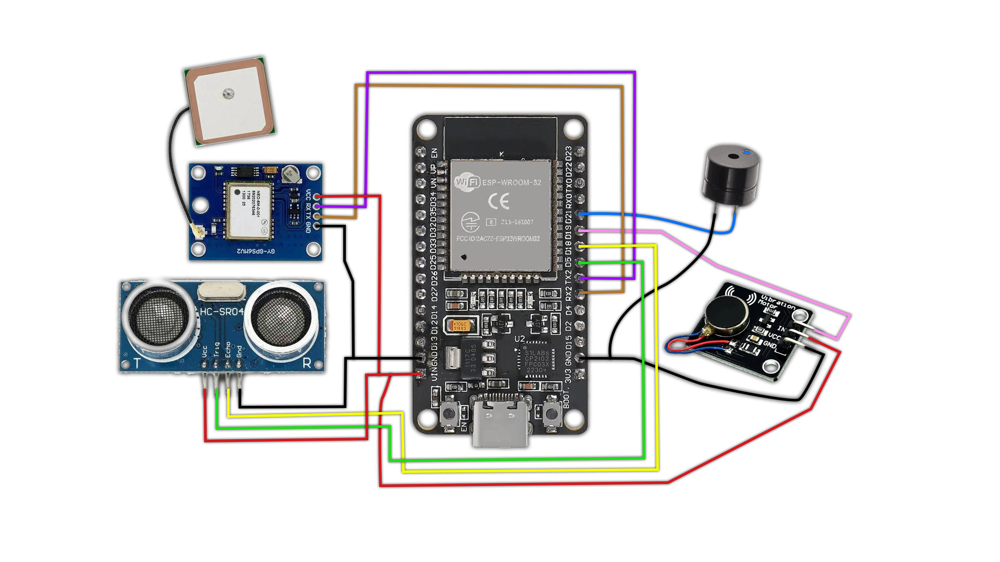

# <div align="center"> ESP32-Smart Blind Stick </div>

**The Smart Blind Stick** is a prototype hybrid mobility aid based on the **Internet of Things (IoT)** designed to enhance the independence and safety of visually impaired individuals in both indoor and outdoor environments. This device combines real-time spatial obstacle detection technology with a smart location tracking system, providing maximum protection for users and peace of mind for their families.

The system is powered by an **ESP32** microcontroller and built on a non-blocking (offline-first) architecture. Its primary safety feature utilizes **ultrasonic sensors** to scan the area in front of the user, then responds by providing tactile **(motor vibration)** and audio **(buzzer)** feedback, the intensity of which is dynamically adjusted based on the distance to the obstacle. The non-blocking architecture ensures this physical protection system operates continuously without interruption, regardless of network connectivity.

To support outdoor mobility, this smart cane is integrated with a **NEO-6M GPS** module and a **Telegram bot**. By utilizing a **Wi-Fi/tethering** connection, the device periodically sends updates on the user’s coordinates in the form of a live map link directly to family members’ devices. This approach results in a lightweight, power-efficient mobility assistance system that is highly responsive to surrounding hazards.

---

## Features

* **Obstacle Detection** using ultrasonic sensor (HC-SR04)
* **Buzzer Alert System** (audio warning)
* **Vibration Feedback** (tactile response)
* **Non-blocking Architecture** (continuous safety monitoring without delays)
* **Smart alert system:**
   * < 50 cm ➔ Continuous alert & max vibration (danger)
   * 50–80 cm ➔ Pulsing alert & soft vibration (warning)
   * 80 > cm ➔ Safe distance (silent)
* **Live Location Tracking** via GPS NEO-6M with periodic Telegram bot updates
* Lightweight and efficient ESP32-based hybrid system (Indoor/Outdoor)

---

## Components

* [**ESP32 Development Board** (30-Pin Type-C)](https://s.shopee.co.id/5fl9L4L7uA)
* [**HC-SR04** Ultrasonic Sensor](https://s.shopee.co.id/9paiIuJeoh)
* [**Active Buzzer**](https://s.shopee.co.id/80947i7l0w)
* [**Mini Vibration Motor Module** (3-Pin variant with built-in driver)](https://s.shopee.co.id/9UxruYCsiu)
* [**NEO-6M V2** GPS Module](https://s.shopee.co.id/4fsc9npd7D)
* [**Jumper Wires**](https://s.shopee.co.id/8piB7MjXzG)

---

## Wiring Schematic


---

## Pin Configuration
To ensure system stability without requiring external buck/boost converters, power routing is divided between the `VIN` (5V raw input) and `3V3` (regulated) pins. 

*Note: The `VIN` and `GND` pins on the ESP32 must be branched/split to accommodate multiple components.*

| Component | Component Pin | ESP32 Pin | Notes |
| :--- | :--- | :--- | :--- |
| **HC-SR04** | VCC | **VIN (5V)** | Requires 5V for accurate reading |
| | GND | **GND** | |
| | Trig | **GPIO 5 (D5)** | |
| | Echo | **GPIO 18 (D18)** | |
| **GPS NEO-6M** | VCC | **VIN (5V)** | Requires 5V for stable satellite fix |
| | GND | **GND** | |
| | TX | **GPIO 16 (RX2)** | Hardware Serial 2 |
| | RX | **GPIO 17 (TX2)** | Hardware Serial 2 |
| **Vibration Motor** | VCC | **VIN (5V)** | Powered via 5V for max vibration strength |
| | GND | **GND** | |
| | IN / Signal | **GPIO 19 (D19)** | Supports PWM for intensity control |
| **Active Buzzer** | VCC (+) | **GPIO 21 (D21)** | Direct to GPIO for tempo/pulsing control |
| | GND (-) | **GND** | |

---

## Installation & Setup
1.  **Clone the Repository:**
    ```bash
    git clone https://github.com/itsmeandra/Smart-Blind-Stick-IoT.git
    ```
2.  **Set Up Telegram Bot:**
    *   Go to Telegram and search for `@BotFather`.
    *   Create a new bot using the `/newbot` command and save your **Bot Token**.
    *   Search for `@IDBot` to find your personal **Chat ID**.
3.  **Configure the Code:**
    *   Open the `.ino` file in Arduino IDE.
    *   Replace `BOT_TOKEN` and `CHAT_ID` with your credentials.
    *   *(Optional)* Adjust the `intervalTelegram` variable (e.g., set to `1 * 60 * 1000UL` for 1-minute testing intervals, or `10 * 60 * 1000UL` for production use).
4.  **Upload to ESP32:**
    *   Select the correct ESP32 board and COM port.
    *   Compile and upload.

---

*Disclaimer: This is a prototype designed for educational and conceptual purposes. It should not replace certified medical mobility aids without further rigorous testing and hardware reinforcement.*